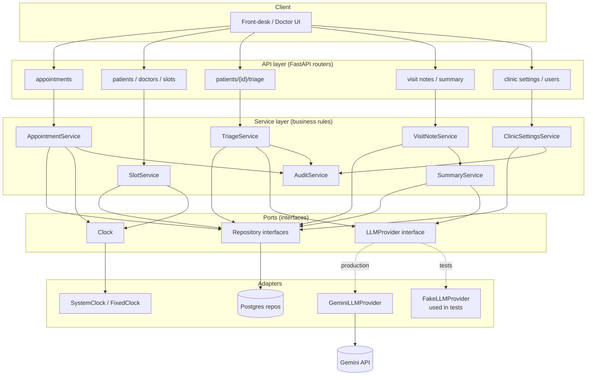

# CareConnect — Specification

Derived from `docs/intent.md`. Items originally flagged as ambiguous have
since been resolved by stakeholder decision (see §9, Resolved ambiguities,
for traceability) and are incorporated directly into the sections below.

## 1. Roles and permissions

- **Front-desk**: full access — users, patients, doctors, appointments,
  availability, visit notes, triage, `ClinicSettings` configuration,
  everything.
- **Doctor**: can **edit** their own doctor data (profile, specialty,
  availability, slot length) and can **read all patients** (records,
  medical history). A doctor **writes** only where they hold the
  appointment: their own appointments, visit notes, follow-ups, triage for
  those patients' bookings. A doctor may register a new patient and book
  with themselves (which creates the relationship). Cannot force-cancel
  past the cutoff, cannot create doctors or users, and cannot configure
  `ClinicSettings`.
- **Patient**: no system account (per intent.md, Constraints) — represented
  as a record only.

"Own appointment" means `Appointment.doctorId` is the doctor's own id.

| Capability | Front-desk | Doctor |
|---|---|---|
| Create / deactivate users, reset passwords | Yes | No |
| Create doctors / specialties | Yes | No |
| Edit doctor profile | Yes | Own only |
| Set weekly availability / exceptions | Yes | Own only |
| Register / edit patient records | Yes | Yes (any patient) |
| Read patients and medical history | Yes | Yes (any patient) |
| Add medical history entries / amendments | Yes | Yes (any patient) |
| Book appointments | Yes | Only with themselves |
| Reschedule / cancel appointments | Yes | Own appointments only |
| Force-cancel past cutoff | Yes | No |
| Check-in / start consultation / complete / mark no-show | Yes | Own appointments only |
| Enter reported symptoms / request AI triage | Yes | Yes |
| Override AI triage result | Yes | Yes, for triage tied to their own appointments |
| Write raw visit notes | Yes | Own appointments only |
| Request AI draft summary | Yes | Own appointments only |
| Finalize visit summary | No | Own appointments only |
| Request / view AI pre-visit summary | Yes (view) | Own appointments only |
| Book follow-up | Yes | Own appointments only |
| View daily queue | Yes | Yes (own appointments only) |
| Configure `ClinicSettings` | Yes | No |

Lifecycle transitions (check-in → in-consultation → completed / no-show)
are triggered manually by front-desk or by the appointment's doctor only —
never automatically and never by the patient.

## 2. Domain model

- **User** — account with `role` (`doctor` | `front_desk_admin`), `active`
  flag, and display `name`. No `patient` role. Created and deactivated by
  front-desk.
- **Doctor** — 1:1 with a `User` where role = doctor. Has one `Specialty`,
  a slot length, an `active` flag, and owns its `Availability` rules.
- **Specialty** — groups doctors; used for specialty-wide search.
- **Availability** — recurring weekly rule per doctor (clinic-local wall
  time), plus **AvailabilityException** for one-off overrides (holiday,
  extra hours). A rule may not overlap another rule for the same doctor
  and day.
- **Patient** — identified by the combination of **E.164 phone number +
  normalized patient name** (trimmed, case-folded), which is unique. A
  single phone number may have multiple patients registered against it
  (e.g. family members), but never the same normalized name twice.
  Demographic/contact fields plus a **free-text, append-only
  `MedicalHistoryEntry` log**.
- **MedicalHistoryEntry** — `kind` is `entry` or `amendment`. An amendment
  references the entry it corrects (`amendsEntryId`); the original is
  never edited or deleted.
- **Appointment** — links one `Doctor`, one `Patient`, a time range
  (`endTime` derived from the doctor's slot length), a `status` (see §3),
  a `source` (`scheduled` | `walk_in`), an `is_emergency_slot` flag with
  its stored `emergencyJustification` and `emergencyAuthorizedBy`,
  optional `reported_symptoms`, an optional `triageResultId`, and an
  optional self-referencing `follow_up_of` pointing to the original
  appointment. Records `checkedInAt`, `completedAt`, and cancellation
  detail: `cancelledAt`, `cancelledBy`, `cancellationType`
  (`standard` | `force` | `rescheduled`), `cancelReason`, and
  `rescheduledToId`.
- **AITriageResult** — belongs to a **Patient** (not an appointment), so
  it can exist before booking and for walk-ins. Holds the reported
  symptoms it was computed from, urgency, suggested specialty,
  **confidence score** (informational only), a `source` (`model` |
  `red_flag`), the model and prompt version, and the server-supplied
  disclaimer. A staff override (urgency, specialty, reason, who, when) is
  stored alongside; the original AI output is preserved, never
  overwritten. Each triage run creates a new record; the most recent is
  the current one and earlier ones are kept for audit. An appointment
  references the triage result it was booked against.
- **VisitNote** — doctor's notes plus an AI-drafted summary and the
  doctor-finalized summary, tied 1:1 to an `Appointment`.
- **PreVisitSummary** — stored AI summary for an `Appointment`, with a hash
  of its inputs so it can be marked stale.
- **ClinicSettings** — clinic-wide configurable policy values (cancellation
  cutoff, emergency holdback count, follow-up window, clinic time zone),
  seeded with sensible defaults and editable by front-desk from the UI
  (see §4).
- **AuditLog** — append-only record of sensitive actions: force-cancel,
  triage override, emergency-slot authorization, user create/deactivate,
  `ClinicSettings` changes.

Relationships: `Doctor 1—N Availability`, `Doctor 1—N AvailabilityException`,
`Doctor 1—N Appointment`, `Patient 1—N Appointment`, `Patient 1—N
MedicalHistoryEntry`, `Patient 1—N AITriageResult`, `Appointment 0—1
AITriageResult (reference)`, `Appointment 0—1 VisitNote`, `Appointment
0—1 PreVisitSummary`, `Appointment 0—1 Appointment` (follow-up
self-reference), `Specialty 1—N Doctor`.

**Patient matching on lookup**: a search by phone number returns every
patient registered under that number; front-desk or doctor selects the
correct patient by name, or registers a new one under the same number.

**Time**: all timestamps are stored and exchanged in UTC.
`ClinicSettings.clinicTimezone` (IANA name) defines "today", the `date`
query parameters, and the wall-time meaning of availability rules.

## 3. Appointment lifecycle

```
Booked → Checked-in → In-consultation → Completed
Booked → Checked-in → No-show
Booked → No-show
Booked → Cancelled
Checked-in → Cancelled
```

- States and the forward path are as given in `docs/intent.md` (Features →
  Booking & lifecycle).
- Any transition not listed above is invalid (409 `INVALID_TRANSITION`).
- Every transition is a manual action taken by front-desk or by the
  appointment's doctor — there is no automatic/timeout-based transition
  (e.g. no-show is always explicitly marked, not auto-applied after a
  grace period).
- A `cancelled` appointment carries a `cancellationType`; a reschedule
  cancels the old appointment with type `rescheduled`.

## 4. Business rules

- **No double-booking**: an overlapping appointment for the same doctor,
  or for the same patient, is rejected. Enforced at the database with
  Postgres exclusion constraints on the appointment time range (one per
  doctor, one per patient), ignoring `cancelled` and `no_show` rows, so
  true overlaps (not only identical start times) are rejected under
  concurrency. Doctor and patient conflicts return distinct error codes.
- **Bookings must be real slots**: a booking's `startTime` must be an
  actual generated slot for that doctor — aligned to the slot grid,
  inside the doctor's availability, not blocked by an exception, and not
  in the past. `endTime` is derived by the server from the doctor's slot
  length. Held-back emergency slots are bookable only with authorization
  (below).
- **Slot sizing**: appointment length is doctor-specific
  (`Doctor.slot_length_minutes`, seeded from the specialty's default but
  editable per doctor). A change applies only to future slot generation;
  existing appointments keep their times.
- **Cancellation cutoff**: both a standard **cancellation and a
  reschedule** are rejected (422 `CANCELLATION_WINDOW_CLOSED`) when
  `start − now ≤ ClinicSettings.cancellation_cutoff_hours` (inclusive at
  exactly the cutoff) — the same cutoff governs both, since a reschedule
  gives up the original slot. Standard cancel applies to `booked` and
  `checked_in`; reschedule only to `booked`. Only a front-desk force-cancel
  can bypass it.
- **Reschedule**: creates a new appointment and cancels the old one
  (`cancellationType = rescheduled`, `rescheduledToId` set) in one
  transaction; the response returns the **new** appointment. The triage
  reference and reported symptoms carry over. A reschedule cannot target a
  held-back emergency slot.
- **Emergency holdback**: `ClinicSettings.emergency_slots_per_doctor_per_day`
  slots per doctor per day — the **last N** slots of that doctor's day —
  are excluded from normal booking (effective N is `min(N, slots that
  day)`). Held slots are released to regular booking 60 minutes before
  their start if still unbooked. Changing N never affects appointments
  already booked. A booking may draw on held-back capacity when
  **either** the patient's current triage result is effectively
  `emergency` (the override wins if present), **or** front-desk makes that
  call directly with a stated reason. The server verifies the triage
  condition; `emergencyJustification`, the authorizing user, and (for
  front-desk judgment) the reason are stored on the appointment and
  written to the audit log.
- **Follow-up window**: a follow-up can only be booked from an appointment
  that is `completed`. It must be for the same doctor and patient, in the
  future, a regular (non-held-back) slot, and its start must fall within
  `ClinicSettings.follow_up_max_days` of the original visit's start. A
  follow-up of a follow-up is measured from the root visit.
- **Force-cancel**: available to front-desk only (not doctors), allowed
  past the cutoff, requires a reason, stored as `cancellationType = force`,
  and written to the audit log.
- **Availability edits**: removing or narrowing a rule, adding an
  `unavailable` exception, or deactivating a doctor is rejected with 409
  `AVAILABILITY_CONFLICTS_WITH_APPOINTMENTS` (listing affected
  appointments) while non-cancelled future appointments would be
  orphaned. An `unavailable` exception with no times means the whole day.
- **Specialty-wide search**: when more than one doctor in the requested
  specialty has an open slot, all matching options are returned as a
  choice for front-desk (on the patient's behalf) to pick from — the
  system does not auto-select "the first slot."
- **Walk-in**: an appointment with `source = walk_in`. It targets a
  specific doctor by default. If that doctor has no regular slot, the
  system offers, in order: (1) other doctors in the same specialty with
  open regular slots (a choice list via specialty search), then (2)
  emergency-held capacity, only when authorized as above.
- **User management safeguards**: a front-desk user cannot deactivate their
  own account or change their own role (400 `VALIDATION_ERROR`), so the
  clinic cannot lock itself out. Passwords must be at least 12 characters.
- **Patient uniqueness**: registering or updating a patient to a
  `(phone, normalized name)` that already exists is rejected with 409
  `PATIENT_ALREADY_EXISTS`.
- **Visit note rules**: notes are writable only while the appointment is
  `in_consultation` or `completed`, and are locked once finalized
  (re-finalize is 409 `VISIT_NOTE_LOCKED`). The AI draft writes
  `aiDraftSummary` only.

**`ClinicSettings` defaults** (seeded values, editable by front-desk via
the UI at any time — not hardcoded). Validated on write: cutoff ≥ 0,
emergency slots ≥ 0, follow-up days ≥ 1, valid IANA time zone.

| Setting | Default |
|---|---|
| `cancellation_cutoff_hours` | 2 |
| `emergency_slots_per_doctor_per_day` | 1 |
| `follow_up_max_days` | 30 |
| `clinic_timezone` | seeded at install (IANA name) |
| `default_triage_specialty_id` | unset; used only for a red-flag result returned while the AI is down |

## 5. AI features

### 5.1 Triage

**Input**:
- Patient-reported symptoms (free text).
- Optional supporting context from the patient's free-text medical
  history.

**Flow**: triage is requested for a **patient** before or during booking
(including walk-ins). The result is then referenced by the appointment
(`triageResultId`) that uses it.

**Model output schema** (validated before use):
- `urgency`: one of `emergency` / `urgent` / `routine`.
- `suggested_specialty`: must match an existing specialty; otherwise the
  response is rejected as schema-invalid.
- `confidence_score`: numeric 0–1. Informational only — displayed to
  staff, never used to gate logic.

The **disclaimer** is a server-side constant attached to every stored
result after validation; it is not part of the model's output.

**Guardrails**:
- Advisory only — never a diagnosis; staff can always override the
  result, and the override (with reason and author) is stored alongside,
  not over, the original AI output, and written to the audit log. The
  override wins when determining effective urgency.
- A deterministic, non-AI red-flag check runs **before** the model call
  and can independently force `urgency = emergency` (`source =
  red_flag`). If the model call fails, a red-flag hit is still returned;
  only when there is no red-flag hit does an AI failure produce 503
  `AI_SERVICE_UNAVAILABLE`. The red-flag list is small, explicit, and
  reviewed like code (see `docs/review.md`); it may only raise urgency.
- Symptom and history text is untrusted input: it is delimited in the
  prompt and treated as data, and the model output must validate against
  the schema regardless of what the text says.
- A safety disclaimer must be shown alongside any triage result — the UI
  may not display urgency/specialty without it.
- Emergency-slot use may be authorized by this result (effective
  `urgency == emergency`) or by independent front-desk judgment — see §4.
- **Personal data is scrubbed from all text before any outbound AI call**
  (triage, summary, and note drafting alike): the patient's known
  name, phone, email, and date of birth are substituted with placeholders
  wherever they appear in free text, and pattern-based redaction removes
  phone numbers, emails, and dates of birth. Redaction is best-effort and
  documented as such. The AI operates on de-identified clinical text only.

### 5.2 Pre-visit summary

Assembled for the doctor from patient history, reported symptoms, and the
triage result. `GET` returns the stored summary (404 if none);
`POST` generates or refreshes it. The stored summary is marked stale when
its input hash no longer matches (history, symptoms, or triage changed).
Output is validated as non-empty, length-bounded text and carries the
advisory disclaimer.

### 5.3 Draft visit summary

Generated from the doctor's raw notes, shown for edit, and **never saved
as the final summary without doctor action**. Output is validated as
non-empty, length-bounded text and carries the advisory disclaimer.

## 6. User stories (Given/When/Then)

**Booking prevents double-booking**
- Given a doctor has an existing appointment at 10:00–10:20
- When front-desk attempts to book a different patient with that doctor at
  10:10
- Then the booking is rejected and no new appointment is created

**Booking prevents patient double-booking**
- Given a patient has an appointment at 10:00–10:20 with one doctor
- When front-desk books the same patient with another doctor at 10:10
- Then the booking is rejected with a patient-specific error

**Booking must be a real slot**
- Given a doctor works 09:00–12:00 with 20-minute slots
- When front-desk books at 09:05, or at a time in the past
- Then the booking is rejected

**Cancellation and reschedule both blocked inside the cutoff window**
- Given an appointment starts in `ClinicSettings.cancellation_cutoff_hours`
  or less
- When front-desk attempts a standard cancellation or a reschedule
- Then the action is rejected, and force-cancel (front-desk only) is
  offered as the only path forward

**Emergency slot reserved from normal booking**
- Given a doctor's day has emergency-held slots per `ClinicSettings.emergency_slots_per_doctor_per_day`
- When front-desk searches for regular bookable slots
- Then the held-back slots (the last N of the day) do not appear in the
  regular results

**Emergency slot usable via triage or front-desk judgment**
- Given a walk-in patient with no regular slot available
- When either the patient's triage result is effectively `emergency`, or
  front-desk decides the case warrants it and states a reason
- Then front-desk can book against the doctor's emergency-held capacity,
  and the justification is stored

**Specialty-wide search offers a choice**
- Given multiple doctors share a specialty with open slots
- When front-desk searches by specialty instead of a specific doctor
- Then all matching doctor/slot options are returned for front-desk to
  choose from, not auto-selected

**Walk-in fallback to another doctor in the specialty**
- Given a walk-in requests a specific doctor who has no availability
- When front-desk checks other doctors in that doctor's specialty
- Then any available doctor in the same specialty is offered as an
  alternative

**Follow-up must fall within the policy window**
- Given a completed appointment and `ClinicSettings.follow_up_max_days`
- When front-desk or the doctor books a follow-up beyond that many days
  out
- Then the booking is rejected

**Patient lookup by phone returns all matches**
- Given two patients ("Asha Rao" and "Kiran Rao") share one phone number
- When front-desk searches by that phone number
- Then both patients are listed, distinguished by name, for selection

**Duplicate patient rejected**
- Given "Asha Rao" is registered under a phone number
- When front-desk registers "asha  rao" under the same number
- Then registration is rejected as a duplicate

**Front-desk daily queue**
- Given today has booked appointments, a checked-in patient, a walk-in, and
  a no-show
- When front-desk opens the daily dashboard
- Then all categories (booked, checked-in, in-progress, completed, no-show,
  cancelled) are visible, distinguishable, and walk-ins are flagged

**AI triage shown with disclaimer and confidence, and overridable**
- Given front-desk or a doctor enters a patient's reported symptoms
- When the triage result is returned
- Then urgency, suggested specialty, confidence score, and the safety
  disclaimer are all shown together, and the result can be overridden with
  a reason

**Red flag returns emergency even if the AI is down**
- Given reported symptoms match a red-flag keyword and the AI provider is
  unavailable
- When triage is requested
- Then an `emergency` result (source `red_flag`) is returned with the
  disclaimer

**Patient identity redacted before reaching the AI provider**
- Given a triage, summary, or draft request is being sent for processing
- When the payload is built for the external AI call
- Then patient name, phone, and other direct identifiers are removed,
  including when they appear inside free text

**Pre-visit summary available to doctor**
- Given an appointment has reported symptoms, a triage result, and
  patient history
- When the doctor requests the pre-visit summary
- Then a generated summary combining those inputs is stored and displayed,
  and marked stale if any input later changes

**Draft visit summary from notes**
- Given a doctor has entered raw visit notes
- When the doctor requests an AI draft summary
- Then a draft is generated and shown for edit, and is never saved as the
  final summary without doctor action

**Medical history correction**
- Given a history entry contains an error
- When staff add an amendment referencing it
- Then both entries remain visible, with the amendment marked as a
  correction

## 7. Architecture

- **Stack**: FastAPI (Python, dependency-managed via `uv`) + PostgreSQL +
  React frontend, delivered as full-stack milestones (`docs/plan.md`).
- **Concurrency safety**: double-booking prevention relies on database
  exclusion constraints (not only application-level checks), so it holds
  under concurrent requests.
- **Auth**: email/password for staff accounts (hashed), JWT-based sessions
  with a short TTL, role (`doctor` / `front_desk_admin`) carried in the
  token and checked per route matching §1; `User.active` is checked on
  every request so deactivation takes effect immediately.

**Layers** — kept intentionally flat (no message queue, no
microservices, a single FastAPI process + Postgres):

1. **API layer** — FastAPI routers. Thin: parse request → call a service
   → serialize response. No business logic here.
2. **Service layer** — `AppointmentService`, `SlotService`,
   `TriageService`, `SummaryService`, `VisitNoteService`,
   `ClinicSettingsService`, plus supporting services `AuthService`,
   `UserService`, `DoctorService`, `PatientService`, `AvailabilityService`,
   `QueueService`, and `AuditService`. All business rules live here (§4).
   Framework-agnostic, depends only on the interfaces below it — this is
   the TDD core, and business-rule tests run without a live DB or network
   call.
3. **Ports (interfaces)** — `AppointmentRepository`, `PatientRepository`,
   etc. for DB access, `Clock` for the current time, and `LLMProvider` for
   AI access. Services depend on these abstract interfaces, never on a
   concrete DB driver or the Gemini SDK directly.
4. **Adapters (implementations)** — `PostgresAppointmentRepository` etc.
   for the repository interfaces; `SystemClock` / `FixedClock`;
   `GeminiLLMProvider` (wraps the `google-genai` SDK, and performs the
   free-text scrubbing from §5.1 before any outbound call) and
   `FakeLLMProvider` (in-memory, canned results) both implement
   `LLMProvider`.

`TriageService` and `SummaryService` take an `LLMProvider` via
constructor injection. Production wiring passes `GeminiLLMProvider`; unit
tests pass `FakeLLMProvider`, so AI-dependent business logic (e.g.
"emergency slot usable when effective urgency is emergency", §4) is
testable with zero network calls. Note drafting is requested through
`VisitNoteService`, which calls `SummaryService` for the AI step.



## 8. API summary

The full API contract — every endpoint, request/response schema, status
code, error code, and auth requirement — is defined in
`docs/openapi.yaml`, which is the single source of truth. This document
does not duplicate it; when the two disagree, `docs/openapi.yaml` wins and
this document is corrected to match.

## 9. Resolved ambiguities

For traceability, the items originally flagged in this document's first
draft and their resolutions:

1. Permissions granularity → §1.
2. Medical history structure → free text, append-only, with amendments (§2).
3. Patient identity/dedup → normalized phone + name, unique; one phone may
   map to multiple patients (§2, §4).
4. Specialty-wide search tie-breaking → present all matching options as a
   choice, no auto-selection (§4).
5. Walk-in scope → doctor-specific by default, falls back to other
   available doctors in the same specialty, then emergency capacity if
   authorized (§4).
6. Lifecycle transition triggers → front-desk or the appointment's doctor
   only, always manual (§3).
7. Cancellation cutoff scope for reschedule → same cutoff applies to both
   (§4).
8. Force-cancel authorization → front-desk only (§4).
9. Emergency-slot authorization → either the effective AI triage result or
   front-desk judgment with a stated reason (§4).
10. AI triage output completeness → confidence score added, informational
    (§5).
11. PII sent to third-party AI → scrubbed from free text before any
    outbound call to Gemini, for all AI features (§5).
12. Exact policy values → sensible defaults seeded, front-desk-editable
    via UI, not hardcoded (§4).

Decisions from the design review of the first complete draft:

13. Overlap enforcement → DB exclusion constraints, not unique start times
    (§4).
14. Triage keyed by patient so it works before booking and for walk-ins
    (§2, §5).
15. Bookings must be real generated slots; `endTime` server-derived (§4).
16. Doctors read all patients and write only for appointments they hold;
    doctors edit, not create, their own profile (§1).
17. Front-desk manages users; deactivation immediate (§1, §7).
18. Walk-ins modeled by `source`; queue buckets are status-based (§2, §4).
19. Holdback = last N slots of the day, released 60 minutes before start
    (§4).
20. Cutoff inclusive at exactly N hours; applies to `booked`/`checked_in`
    cancel, `booked` reschedule (§4).
21. Reschedule = new appointment + old cancelled as `rescheduled` (§4).
22. UTC storage with a single clinic time zone (§2).
23. Availability edits that orphan appointments are rejected (§4).
24. Follow-up only from `completed`, window measured from original start
    (§4).
25. Red-flag check returns emergency even if the AI is down; disclaimer is
    a server constant; override wins with reason and audit (§5.1).
26. Pre-visit summary is stored, `POST` refreshes, marked stale on input
    change (§5.2).
27. Visit notes are status-gated and locked after finalize; front-desk may
    enter raw notes but only the doctor finalizes (§1, §4).
