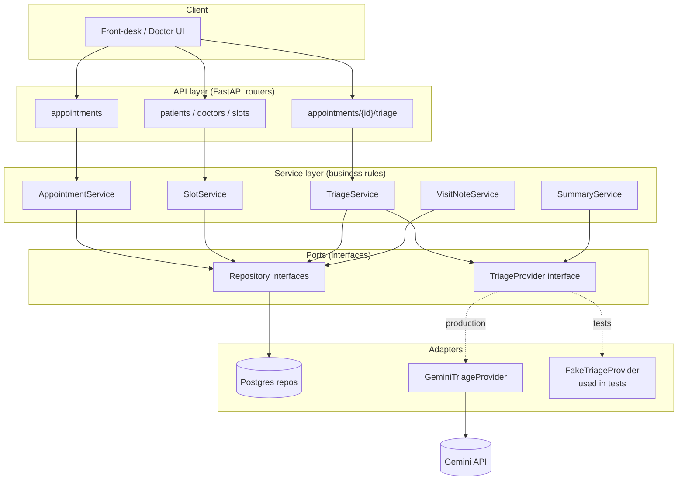

# CareConnect — Specification

Derived from `docs/intent.md`. Items originally flagged as ambiguous have
since been resolved by stakeholder decision (see §9, Resolved ambiguities,
for traceability) and are incorporated directly into the sections below.

## 1. Roles and permissions

- **Front-desk**: full access — patients, appointments, availability,
  visit notes, triage, `ClinicSettings` configuration, everything.
- **Doctor**: can create/edit their own doctor data (profile, specialty,
  availability, slot length) and their own patients' data (patient
  records, medical history, appointments, visit notes, follow-ups,
  triage). Cannot force-cancel past the cutoff and cannot configure
  `ClinicSettings`.
- **Patient**: no system account (per intent.md, Constraints) — represented
  as a record only.

| Capability | Front-desk | Doctor |
|---|---|---|
| Register/edit patient records | Yes | Yes, for their own patients |
| Set weekly availability / exceptions | Yes | Yes, own only |
| Book / reschedule / cancel appointments | Yes | Yes, for their own patients |
| Force-cancel past cutoff | Yes | No |
| Check-in / start consultation / mark no-show | Yes | Yes |
| Enter reported symptoms / request AI triage | Yes | Yes, for their own patients |
| Override AI triage result | Yes | Yes, for their own patients |
| Write visit notes / request AI draft summary | Yes | Yes, own patients (primary intended user, per intent.md Features) |
| Book follow-up | Yes | Yes, own patients |
| Configure `ClinicSettings` | Yes | No |

Lifecycle transitions (check-in → in-consultation → completed / no-show)
are triggered manually by front-desk or doctor only — never automatically
and never by the patient.

## 2. Domain model

- **User** — account with `role` (`doctor` | `front_desk_admin`). No
  `patient` role.
- **Doctor** — 1:1 with a `User` where role = doctor. Has one `Specialty`,
  a slot length, and owns its `Availability` rules.
- **Specialty** — groups doctors; used for specialty-wide search.
- **Availability** — recurring weekly rule per doctor, plus
  **AvailabilityException** for one-off overrides (holiday, extra hours).
- **Patient** — identified by the combination of **phone number + patient
  name** (not phone alone — a single phone number may have multiple
  patients registered against it, e.g. family members). Demographic/contact
  fields plus a **free-text, append-only `MedicalHistoryEntry` log**.
- **Appointment** — links one `Doctor`, one `Patient`, a time range, a
  `status` (see §3), an `is_emergency_slot` flag, optional
  `reported_symptoms`, an optional `AITriageResult`, and an optional
  self-referencing `follow_up_of` pointing to the original appointment.
- **AITriageResult** — urgency, suggested specialty, **confidence score**,
  disclaimer, plus an optional staff override (original AI output is
  preserved, never overwritten).
- **VisitNote** — doctor's notes plus an AI-drafted summary and the
  doctor-finalized summary, tied 1:1 to an `Appointment`.
- **ClinicSettings** — clinic-wide configurable policy values (cancellation
  cutoff, emergency holdback count, follow-up window), seeded with sensible
  defaults and editable by front-desk from the UI (see §4).

Relationships: `Doctor 1—N Availability`, `Doctor 1—N AvailabilityException`,
`Doctor 1—N Appointment`, `Patient 1—N Appointment`, `Patient 1—N
MedicalHistoryEntry`, `Appointment 0—1 AITriageResult`, `Appointment 0—1
VisitNote`, `Appointment 0—1 Appointment` (follow-up self-reference),
`Specialty 1—N Doctor`.

**Patient matching on lookup**: a search by phone number returns every
patient registered under that number; front-desk (or, when relevant,
doctor) selects the correct patient by name, or registers a new one under
the same number.

## 3. Appointment lifecycle

```
Booked → Checked-in → In-consultation → Completed
Booked → Checked-in → No-show
Booked → No-show
Booked → Cancelled
Checked-in → Cancelled
```

- States and the forward path are as given in `docs/intent.md` (Features →
  Booking & lifecycle).
- Any transition not listed above is invalid.
- Every transition is a manual action taken by front-desk or by the
  doctor — there is no automatic/timeout-based transition (e.g. no-show is
  always explicitly marked, not auto-applied after a grace period).

## 4. Business rules

- **No double-booking**: an overlapping appointment for the same doctor,
  or for the same patient, is rejected — enforced at the database level,
  not just checked in application code.
- **Slot sizing**: appointment length is doctor-specific (`Doctor.slot_length_minutes`,
  seeded from the specialty's default but editable per doctor).
- **Cancellation cutoff**: both a standard **cancellation and a
  reschedule** are rejected once the current time is inside
  `ClinicSettings.cancellation_cutoff_hours` before the appointment start
  — the same cutoff governs both, since a reschedule gives up the original
  slot. Only a front-desk force-cancel can bypass it.
- **Emergency holdback**: `ClinicSettings.emergency_slots_per_doctor_per_day`
  slots per doctor per day are excluded from normal booking. A booking may
  draw on this held-back capacity when **either** the AI triage result
  classifies the case as `emergency`, **or** front-desk makes that call
  directly (e.g. AI triage wasn't run, or staff overrides it) — either
  condition alone is sufficient.
- **Follow-up window**: a follow-up appointment must fall within
  `ClinicSettings.follow_up_max_days` of the original visit.
- **Force-cancel**: available to front-desk only (not doctors), allowed
  past the cutoff, logged as distinct from a standard cancellation.
- **Specialty-wide search**: when more than one doctor in the requested
  specialty has an open slot, all matching options are returned as a
  choice for front-desk (on the patient's behalf) to pick from — the
  system does not auto-select "the first slot."
- **Walk-in fallback**: a walk-in targets a specific doctor by default; if
  that doctor has no availability, the system offers the patient the
  choice of other available doctors within the same specialty.

**`ClinicSettings` defaults** (seeded values, editable by front-desk via
the UI at any time — not hardcoded):

| Setting | Default |
|---|---|
| `cancellation_cutoff_hours` | 2 |
| `emergency_slots_per_doctor_per_day` | 1 |
| `follow_up_max_days` | 30 |

## 5. AI triage feature

**Input**:
- Patient-reported symptoms (free text).
- Optional supporting context from the patient's free-text medical
  history.

**Output schema**:
- `urgency`: one of `emergency` / `urgent` / `routine`.
- `suggested_specialty`.
- `confidence_score`: numeric confidence in the classification.
- `disclaimer`: safety disclaimer text, required to accompany the result
  wherever it's shown.

**Guardrails**:
- Advisory only — never a diagnosis; staff can always override the
  result, and the override is stored alongside (not over) the original AI
  output.
- A safety disclaimer must be shown alongside any triage result — the UI
  may not display urgency/specialty without it.
- Emergency-slot use may be authorized by this result (`urgency ==
  emergency`) or by independent front-desk judgment — see §4.
- **Patient-identifying fields (name, phone, and any other direct
  identifiers) are redacted before the symptoms/history payload leaves the
  system and reaches the external AI provider (Gemini).** The AI service
  operates on de-identified clinical text only; identity is re-attached to
  the result locally after the response returns.

## 6. User stories (Given/When/Then)

**Booking prevents double-booking**
- Given a doctor has an existing appointment at 10:00–10:20
- When front-desk attempts to book a different patient with that doctor at
  10:10
- Then the booking is rejected and no new appointment is created

**Cancellation and reschedule both blocked inside the cutoff window**
- Given an appointment starts in less time than `ClinicSettings.cancellation_cutoff_hours`
- When front-desk attempts a standard cancellation or a reschedule
- Then the action is rejected, and force-cancel (front-desk only) is
  offered as the only path forward

**Emergency slot reserved from normal booking**
- Given a doctor's day has emergency-held slots per `ClinicSettings.emergency_slots_per_doctor_per_day`
- When front-desk searches for regular bookable slots
- Then the held-back slots do not appear in the regular results

**Emergency slot usable via triage or front-desk judgment**
- Given a walk-in patient with no regular slot available
- When either the AI triage result is `emergency`, or front-desk decides
  the case warrants it without a triage result
- Then front-desk can book against the doctor's emergency-held capacity

**Specialty-wide search offers a choice**
- Given multiple doctors share a specialty with open slots
- When front-desk searches by specialty instead of a specific doctor
- Then all matching doctor/slot options are returned for front-desk to
  choose from, not auto-selected

**Walk-in fallback to another doctor in the specialty**
- Given a walk-in requests a specific doctor who has no availability
- When front-desk checks other doctors in that doctor's specialty
- Then any available doctor in the same specialty is offered as an
  alternative

**Follow-up must fall within the policy window**
- Given a completed appointment and `ClinicSettings.follow_up_max_days`
- When front-desk or the doctor books a follow-up beyond that many days
  out
- Then the booking is rejected

**Patient lookup by phone returns all matches**
- Given two patients ("Asha Rao" and "Kiran Rao") share one phone number
- When front-desk searches by that phone number
- Then both patients are listed, distinguished by name, for selection

**Front-desk daily queue**
- Given today has booked appointments, a walk-in, and a no-show
- When front-desk opens the daily dashboard
- Then all categories (booked, walk-in, in-progress, no-show) are visible
  and distinguishable

**AI triage shown with disclaimer and confidence, and overridable**
- Given front-desk or a doctor enters a patient's reported symptoms
- When the AI triage result is returned
- Then urgency, suggested specialty, confidence score, and the safety
  disclaimer are all shown together, and the result can be overridden

**Patient identity redacted before reaching the AI provider**
- Given a triage request is being sent for processing
- When the payload is built for the external AI call
- Then patient name, phone, and other direct identifiers are stripped
  before the request leaves the system

**Pre-visit summary available to doctor**
- Given an appointment has reported symptoms, a triage result, and
  patient history
- When the doctor opens the appointment before the consultation
- Then a generated summary combining those inputs is displayed

**Draft visit summary from notes**
- Given a doctor has entered raw visit notes
- When the doctor requests an AI draft summary
- Then a draft is generated and shown for edit, and is never saved as the
  final summary without doctor action

## 7. Architecture

- **Stack**: FastAPI (Python, dependency-managed via `uv`) + PostgreSQL +
  React frontend.
- **Concurrency safety**: double-booking prevention relies on database
  uniqueness constraints (not only application-level checks), so it holds
  under concurrent requests.
- **Auth**: email/password for staff accounts, JWT-based sessions, role
  (`doctor` / `front_desk_admin`) carried in the token and checked per
  route, matching the permissions in §1.

**Layers** — kept intentionally flat (no message queue, no
microservices, a single FastAPI process + Postgres) so it is buildable in
a day:

1. **API layer** — FastAPI routers. Thin: parse request → call a service
   → serialize response. No business logic here.
2. **Service layer** — `AppointmentService`, `SlotService`,
   `TriageService`, `SummaryService`, `VisitNoteService`,
   `ClinicSettingsService`. All business rules live here (§4).
   Framework-agnostic, depends only on the interfaces below it — this is
   the TDD core, and business-rule tests run without a live DB or network
   call.
3. **Ports (interfaces)** — `AppointmentRepository`, `PatientRepository`,
   etc. for DB access, and `TriageProvider` for AI access. Services
   depend on these abstract interfaces, never on a concrete DB driver or
   the Gemini SDK directly.
4. **Adapters (implementations)** — `PostgresAppointmentRepository` etc.
   for the repository interfaces; `GeminiTriageProvider` (wraps the
   `google-genai` SDK, and performs the PII-redaction step from §5 before
   any outbound call) and `FakeTriageProvider` (in-memory, canned
   results) both implement `TriageProvider`.

`TriageService` takes a `TriageProvider` via constructor injection.
Production wiring passes `GeminiTriageProvider`; unit tests pass
`FakeTriageProvider`, so triage-dependent business logic (e.g. "emergency
slot usable when urgency == emergency", §4) is testable with zero network
calls. `SummaryService` (pre-visit summary, note drafting) uses the same
`TriageProvider` port for its Gemini calls.



## 8. API summary

The full API contract — every endpoint, request/response schema, status
code, and auth requirement — is defined in `docs/openapi.yaml`, which is
the single source of truth. This document does not duplicate it; when the
two would otherwise disagree, `docs/openapi.yaml` wins.

## 9. Resolved ambiguities

For traceability, the items originally flagged in this document's first
draft and their resolutions:

1. Permissions granularity → §1.
2. Medical history structure → free text (§2).
3. Patient identity/dedup → phone + name combination, one phone may map to
   multiple patients (§2).
4. Specialty-wide search tie-breaking → present all matching options as a
   choice, no auto-selection (§4).
5. Walk-in scope → doctor-specific by default, falls back to other
   available doctors in the same specialty (§4).
6. Lifecycle transition triggers → front-desk or doctor only, always
   manual (§3).
7. Cancellation cutoff scope for reschedule → same cutoff applies to both
   (§4).
8. Force-cancel authorization → front-desk only (§4).
9. Emergency-slot authorization → either AI triage result or front-desk
   judgment (§4).
10. AI triage output completeness → confidence score added (§5).
11. PII sent to third-party AI → patient-identifying fields redacted
    before any outbound call to Gemini (§5, §7).
12. Exact policy values → sensible defaults seeded, front-desk-editable
    via UI, not hardcoded (§4).
